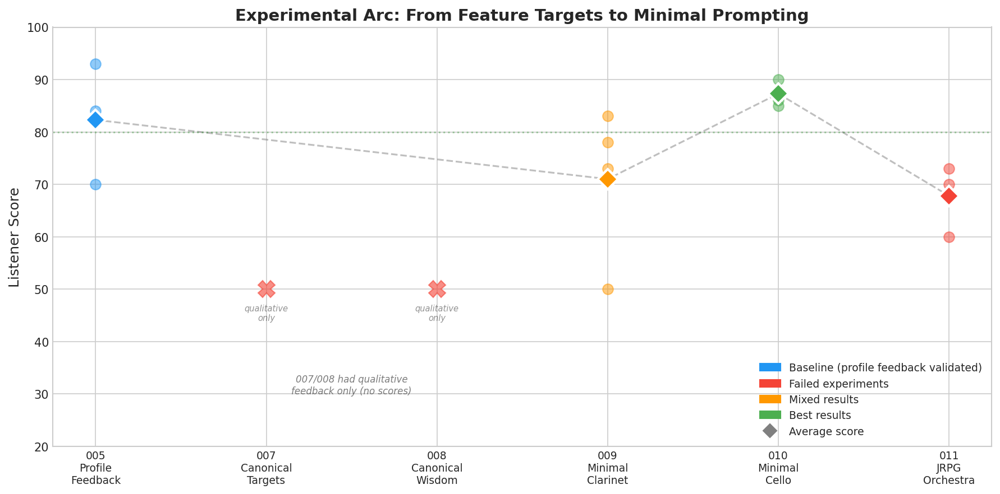
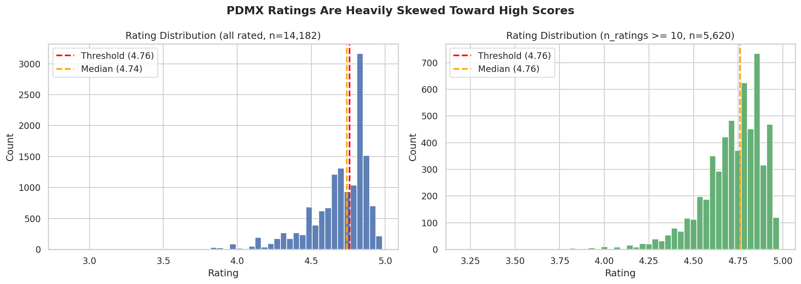
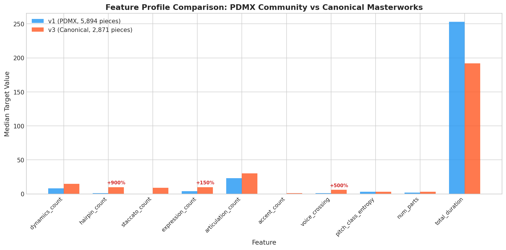
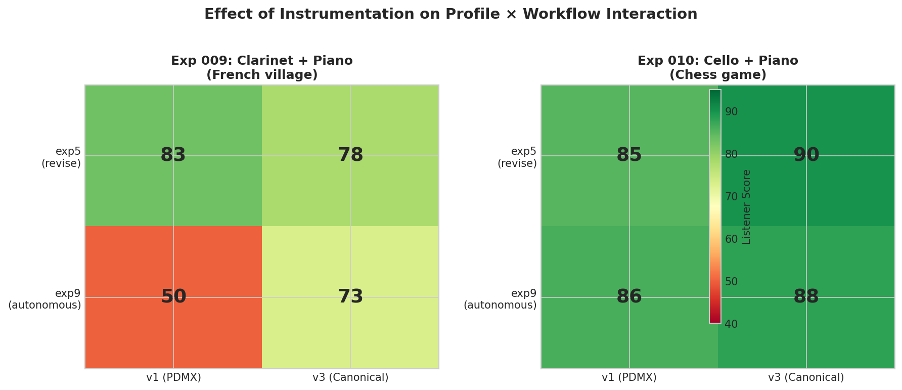
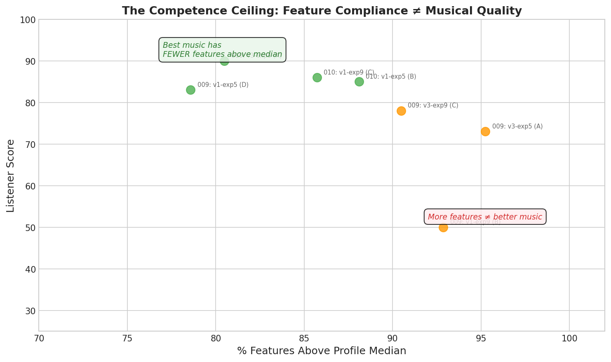
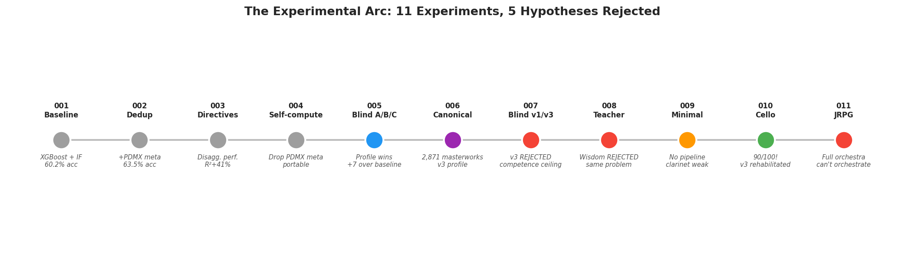

# MusicLaude: What Happens When You Let an LLM Compose Music and Then Grade Its Own Homework

## What is this?

MusicLaude is a system where an LLM (Claude) composes music as MusicXML notation, a quality assessment pipeline trained on 250K+ human-rated scores provides feedback, and the LLM decides whether to revise. Over 11 experiments across two days, we discovered that **the less you constrain the LLM, the better it composes** — and that the choice of instrument matters more than anything else we tested.

Our best piece scored 90/100 in a blind listening test. It was produced by the simplest possible setup: a one-sentence vibe ("a chess game between old friends in a park"), cello + piano, and one round of advisory feedback.

---

## The Short Version

We tried a lot of things. Most of them made the music worse:

- Detailed song contracts with section-by-section specifications? **Worse.**
- Feature targets from Beethoven and Mozart? **Way worse.** ("Clownhouse music.")
- Injecting compositional principles into the prompt? **Also worse.**
- Forcing the LLM to iterate on feedback until it hits target numbers? **Worse still.**

What actually worked:

1. Give it a vibe in one sentence
2. Two instruments, max (cello + piano is the sweet spot)
3. Let it compose freely
4. Show it the quality profile as *suggestions*
5. Let it decide what to change

That's it. The rest of this report is the story of how we figured that out.


*Listener scores across experiments. 007 and 008 had qualitative feedback only (both were bad). The trend: less constraint → better music.*

---

## The Dataset

### PDMX: 254K Scores with Ratings

We trained on the [PDMX dataset](https://zenodo.org/records/14648209) — 254,077 public domain MusicXML scores from MuseScore with user ratings. After filtering to pieces with 10+ ratings, we got 5,620 with a balanced quality split.



### Canonical Repertoire: 2,871 Masterworks

We also assembled 2,871 MusicXML scores from Bach, Beethoven, Mozart, Schubert, Chopin, and others via [OpenScore](https://github.com/OpenScore) and [DCML](https://github.com/DCMLab). These are definitionally good music — no ratings needed.

Getting the DCML scores into MusicXML required a fun hack: MuseScore 3.2.3 refused to open files saved by MuseScore 3.6.2 ("newer version"), but the version check is just an XML header. Patching two strings in the header converted all 1,223 files with zero failures.

### Two Reference Profiles

We built feature profiles from both corpora. The canonical profile (v3) has dramatically higher expression targets — 900% more hairpins, 87% more dynamics:



The question: do higher targets produce better LLM music?

---

## What We Measure

42+ features extracted from each MusicXML file using music21:

**Harmonic** — chord vocabulary, extended chords, cadences, key stability, modulations
**Melodic** — interval sizes, stepwise motion, range, contour, rhythm variety, repetition
**Structural** — parts, duration, dynamics, hairpins, expression marks, staccato, accents, tempo
**Orchestration** — instrument count, voice crossings, range utilization, doubling
**Coherence** — note density, rest ratio, pitch entropy, melodic autocorrelation, phrase regularity, consonance, rhythmic independence

The coherence features specifically target LLM failure modes: wall-of-notes, random-walk melodies, no breathing room, parts in lockstep.

**The #1 predictor of quality:** dynamics_count. Pieces with dynamic markings (pp, mf, ff, crescendo) are rated substantially higher. This is consistent across every model we trained.

---

## The Quality Pipeline

Three signals, in order of usefulness:

**1. Feature Profile (the main thing).** Compares each feature against distributions from high-quality music. Produces percentile ranks weighted by feature importance. Gives specific feedback like: "your dynamics_count=0 is at the 3rd percentile, target median is 8."

**2. XGBoost classifier/regressor.** 60.2% binary accuracy, R²=0.039. The predictions are noisy (compressed rating range), but the feature importance ranking is stable and valuable.

**3. Isolation Forest.** Trained on 25K+ pieces to flag music that deviates from human-composed distributions. Catches pathological LLM outputs.

The profile is what matters. It's the feedback the LLM reads when deciding what to revise.

---

## The Experiments

### 001-004: Building the Foundation

Four experiments refined the feature pipeline. Key finding: dynamics_count is the #1 predictor, and the importance ranking is stable across model variants. We dropped PDMX metadata features so the models work on new compositions.

### 005: The Blind A/B/C Test

Three songs, three conditions each: no feedback, XGBoost feedback, profile feedback. Blind listening.

**Profile feedback won** — avg +7 points over baseline vs +1.3 for XGBoost. The listener praised profile-revised pieces for "subtle touches" and "actual style." This set the profile as the default.

What we didn't appreciate at the time: the compositions were generated with minimal constraints. That turned out to matter more than the feedback itself.

### 006: The Canonical Corpus

Built the 2,871-piece corpus and extracted the v3 profile. Canonical pieces have way more expression than community uploads. Hypothesis: canonical targets → better music.

### 007: The Competence Ceiling

Four compositions of the same piece with different profiles. Blind listening.

**The canonical profiles bombed.** The listener described one as:

> *"It's almost like a clownhouse. Like something that would play in a horror film as a group of clowns gets ready to slaughter their unsuspecting audience."*

The LLM hit Beethoven's dynamics count on paper but produced incoherent music. **The competence ceiling problem:** hitting high feature counts without the underlying compositional skill produces music that's numerically correct but musically empty.

### 008: Teacher Not Grader

We analyzed 198 richly annotated canonical pieces and extracted compositional principles (53% of dynamics at phrase boundaries, 67% of accents on weak beats, staccatos cluster in passages). Injected these into the compose prompt.

**Also bombed.** The wisdom-enhanced version scored 41/42 features above median but the listener called it "unpleasant to listen to" and "listening to nothing." The control version with no wisdom "felt like a song."

The competence ceiling applies to principles too, not just targets.

### 009: Kill the Pipeline

The breakthrough insight: *"Skills dampen agent exploration. By giving the agent a contract, then forcing it to fill that contract, then forcing it with feedback to add things it doesn't care for, we've lost any musical coherence."*

We stripped everything: one-sentence vibe, no contract, no template, 2×2 design testing profiles and feedback workflows.

**Massive improvement.** But clarinet writing was bad across the board — "MAYBE IT JUST CANT WRITE CLARINET LINES? LIKE OH MY GOD."

### 010: The Sweet Spot

Same 2×2 design but cello + piano instead of clarinet, new vibe: "chess game between old friends in a park."

**Best results in the project.** All four tracks scored 85-90. The v3 canonical profile — the same one that produced "clownhouse" music in 007 — won with 90/100.


*Changing the instrument (left → right) was worth more than any profile or workflow change.*

The listener on the winning track:

> *"This is really quite pleasant to listen to. Its continuous and flowing, it has a strong melody, an answer response pattern between the piano and cello as they dance back and forth... 1:27 holy shit! Wow! WOW!"*

### 011: The Orchestration Ceiling

JRPG main menu theme, free instrumentation choice. All four agents independently chose full orchestra (6-9 parts: harp, flute, horn, strings).

**All four were bad.** "No sound pyramid." "Everything happening at once in the same pitch." "Cursed."

The LLM knows the *vocabulary* of orchestration from text descriptions ("Uematsu uses harp arpeggios over sustained strings") but can't manage vertical relationships between 6+ simultaneous voices. It's reconstructing what orchestral music *should look like as notation* from descriptions of what it *sounds like* — without much (if any) actual MusicXML in its training data.

| Instrumentation | Parts | Avg Score |
|----------------|-------|-----------|
| Cello + Piano | 2 | **87** |
| Clarinet + Piano | 2 | 71 |
| Full Orchestra | 6-9 | 68 |


*More features above median ≠ better music. The best-sounding piece (90/100) had only 33/41 features passing.*

---

## What We Learned

### The pipeline is the enemy

Every rigid pipeline (contract → skill → forced feedback) produced worse music than just saying "compose something." Constraints that look helpful on paper — detailed specifications, iterative revision, compositional principles — all made the music worse by stripping away the LLM's ability to make coherent musical choices.

### Feature compliance ≠ musical quality

The most counterintuitive finding. Pieces that hit 41/42 features were described as "clownhouse" and "listening to nothing." The piece that scored 90/100 had only 33/41 features passing. Features as mandatory targets are harmful. Features as advisory suggestions can help.

### Instrumentation is the biggest lever

Changing from clarinet to cello improved scores by 23% under identical conditions. Going from duo to full orchestra dropped scores by 22%. The LLM writes idiomatically for some instruments and poorly for others. Two parts is the sweet spot.

### The canonical profile works — when you don't straitjacket it

The v3 profile's journey: "clownhouse" (007) → "listening to nothing" (008) → competitive (009) → **winner at 90/100** (010). The profile was never wrong. The rigid pipeline was wrong.

### The recipe

```
One-sentence vibe → LLM composes freely (2 parts max)
                   → Quality profile feedback (advisory)
                   → LLM decides what to change
                   → Done
```



---

## Try It Yourself

MusicLaude's quality pipeline works with **any coding agent** — Claude Code, OpenAI Codex, ChatGPT, or anything that can write music21 Python. The value is in the assessment, not the specific composer.

```python
from musiclaude.compose.feedback import run_feedback_loop

result = run_feedback_loop(
    musicxml_path="path/to/score.musicxml",
    profile_path="models/feature_profile_v3.joblib",
    output_dir="output",
    max_iterations=1,
)
print(result["critique_text"])  # Ranked suggestions
```

Generated `.musicxml` files open directly in [MuseScore](https://musescore.org) for manual editing and polish. AI first draft + human refinement is probably the best workflow.

See the [README](../README.md) for setup instructions.

---

## What's Next

- **Instrument mapping** — systematically test which instruments the LLM writes well for
- **Genre expansion** — jazz, film score, minimalist, romantic
- **Longer compositions** — all experiments were 50-80 measures
- **No-feedback baseline** under minimal prompting — is the revision round actually helping?
- **Multi-listener validation** — we know what one person thinks; what about ten?

---

## References

- PDMX Dataset. Plitsis et al., 2024. arXiv:2409.10831
- music21. Cuthbert & Ariza, ISMIR 2010
- XGBoost. Chen & Guestrin, KDD 2016
- OpenScore Lieder Corpus. github.com/OpenScore/Lieder
- DCML Corpora. github.com/DCMLab
